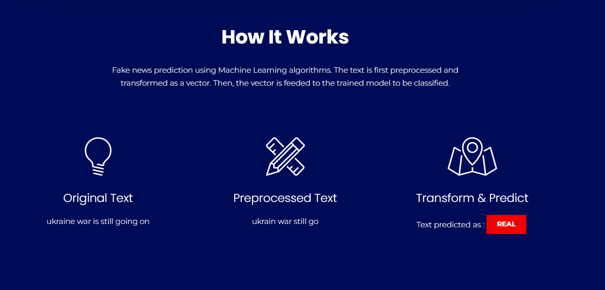

# Fake News Detection
This project uses machine learning to classify news articles as either real or fake. The process involves several steps, including text preprocessing, vectorization, and classification. This README provides an overview of how the system works and how to use it.
## Requirements
Before running the project, ensure you have the following dependencies installed:

Python 3.x
nltk
joblib
scikit-learn
pandas

You can install the necessary libraries using:
```bash
pip install nltk joblib scikit-learn pandas
```
Additionally, you need to download the NLTK stopwords dataset:
```python
import nltk
nltk.download('stopwords')
```
## Files

model.pkl: The pre-trained machine learning model used for classification.
tfidfvect.pkl: The trained TF-IDF vectorizer used for transforming text into numerical vectors.

## How It Works
The Fake News Detection system involves the following steps:

Preprocessing:

The input text is cleaned by removing non-alphabetical characters, converting to lowercase, and splitting into words.
Stopwords (commonly used words like "and", "the", etc.) are removed.
Words are then stemmed to reduce them to their root form.


Text Vectorization:

After preprocessing, the cleaned text is converted into a numerical vector using a trained TF-IDF vectorizer.


Prediction:

The vectorized text is passed through the pre-trained machine learning model, which predicts whether the news is "REAL" or "FAKE".


## How to Use
To use the Fake News Detection model, follow the steps below:
### 1. Load the Model and Vectorizer
```python
import joblib
Load the pre-trained machine learning model and vectorizer
model = joblib.load('model.pkl')
tfidfvect = joblib.load('tfidfvect.pkl')
```
### 2. Create an Instance of the Prediction Model
You can now create an instance of the PredictionModel class by passing the original news article text:
```python
from prediction_model import PredictionModel
Replace with your news article text
original_text = "Insert the news article text here."
Create an instance of the PredictionModel
prediction_model = PredictionModel(original_text)
```
### 3. Predict Fake or Real
Call the predict() method to get the classification:
```python
result = prediction_model.predict()
print(result)
```
The output will be a dictionary containing:
```json
{
"original": "Insert the news article text here.",
"preprocessed": "insert new articl text",
"prediction": "FAKE"
}
```
## Explanation of the Code
### Text Preprocessing
The preprocess() method handles text cleaning and preparation by:

Removing non-alphabetic characters
Converting the text to lowercase
Removing stopwords
Stemming words to their root form

### Prediction
The predict() method takes the preprocessed text, vectorizes it using the TF-IDF vectorizer, and passes it through the pre-trained machine learning model to predict whether the news is real or fake.
## Conclusion
This project provides a basic framework for fake news detection using machine learning. It can be extended with more advanced techniques such as deep learning or enhanced feature engineering for improved accuracy.
!Image 1
!Image 2

